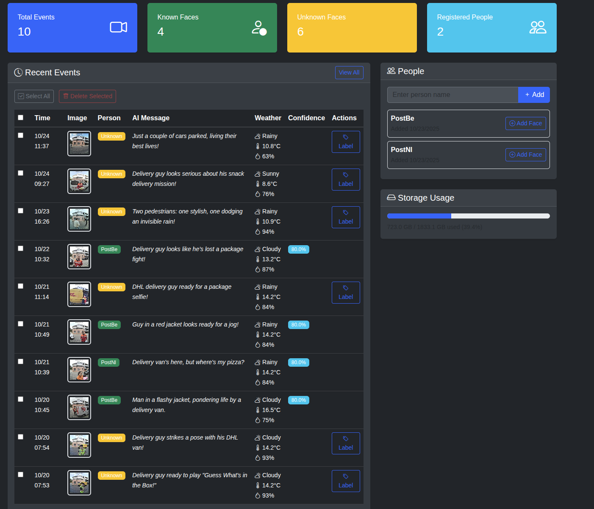
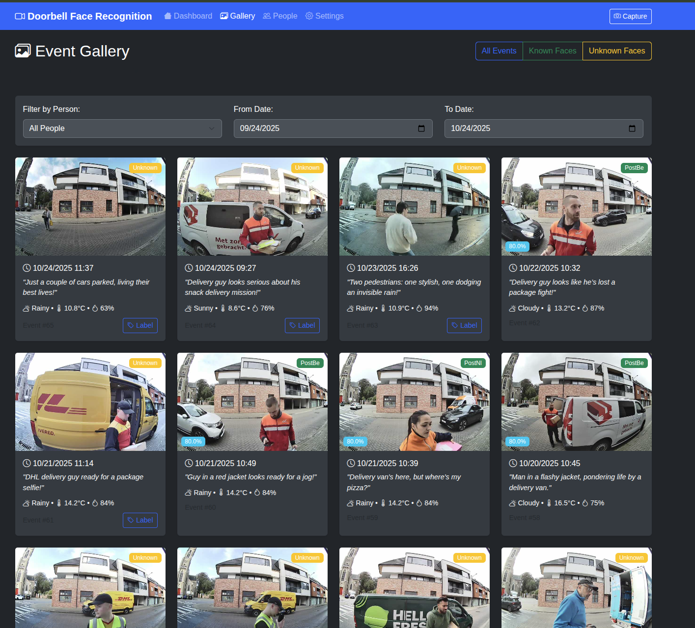
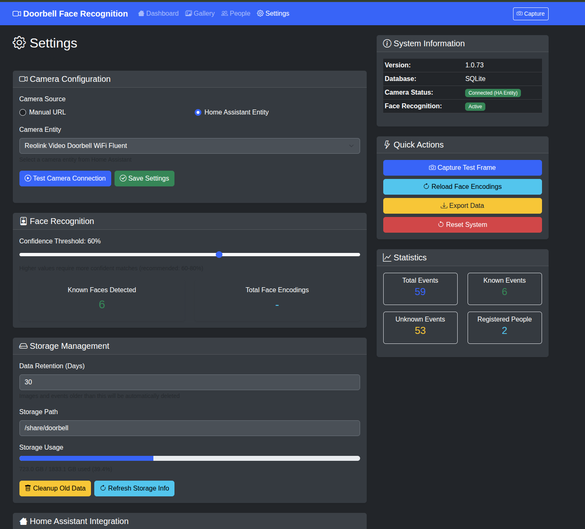

# WhoRang - Doorbell Face Recognition Add-on

[](https://github.com/Beast12/whorang/releases)
[](LICENSE)
[](https://www.home-assistant.io/)
[](https://github.com/Beast12/whorang/actions/workflows/build.yml)

Face recognition doorbell add-on for Home Assistant. This add-on provides event-driven face detection and recognition, triggered when your doorbell is pressed, allowing you to identify known visitors and receive notifications when unknown faces are detected at your door.

## ✨ Features

- 🎯 **Face Recognition** - Uses the face_recognition library (ML-based) for accurate face detection and identification
- 🔔 **Event-Driven Processing** - Face recognition triggered by doorbell ring events, not continuous monitoring
- 🏠 **Native Home Assistant Integration** - Sensors, notifications, and automations
- 🖥️ **Beautiful Web Interface** - Modern, responsive UI for managing faces and viewing events
- 🔒 **Privacy-Focused** - All processing happens locally, no cloud dependencies
- 📱 **Multi-Platform Support** - Works on amd64, arm64, armv7, and other architectures
- 🗄️ **Secure Storage** - SQLite database with optional encryption
- 🔔 **Flexible Notifications** - Home Assistant notifications and webhook support
- 📊 **Event Gallery** - Browse and manage doorbell events with filtering
- ⚙️ **Configurable Settings** - Adjustable confidence thresholds and retention policies
- 🌤️ **Weather Integration** - Capture weather conditions with each doorbell event
- 🤖 **AI Description Support** - Can receive and display AI-generated descriptions from external integrations (e.g., LLM Vision)

## 📋 Requirements

- Home Assistant OS, Supervised, or Container
- Compatible doorbell camera with RTSP/HTTP stream or Home Assistant camera entity
- Minimum 2GB RAM (4GB recommended for face recognition)
- 10GB free storage space

## 📸 Screenshots

### Dashboard

*View recent events, statistics, and quick access to all features*

### Gallery

*Browse all doorbell events with filtering and search capabilities*

### Settings

*Configure camera, face recognition, and integration settings*

## 🚀 Quick Start

### 1. Installation

#### Method 1: Add Repository to Home Assistant (Recommended)

1. In Home Assistant, go to **Settings** → **Add-ons** → **Add-on Store**
2. Click the **⋮** menu in the top right corner
3. Select **Repositories**
4. Add this repository URL: `https://github.com/Beast12/whorang`
5. Find "Doorbell Face Recognition" in the add-on store
6. Click **Install**

#### Method 2: Manual Installation

```bash
cd /usr/share/hassio/addons/local/
git clone https://github.com/Beast12/whorang.git
```

Then restart Home Assistant and find the add-on under **Local Add-ons**.

### 2. Configuration

Configure the add-on with your camera settings. You must provide **either** `camera_entity` **OR** `camera_url`:

**Option A: Using Home Assistant Camera Entity (Recommended)**
```yaml
camera_entity: "camera.your_doorbell_camera"
storage_path: "/share/doorbell"
retention_days: 30
face_confidence_threshold: 0.6
notification_webhook: ""
database_encryption: false
ha_access_token: ""
```

**Option B: Using Direct RTSP/HTTP URL**
```yaml
camera_url: "rtsp://192.168.1.100:554/stream"
storage_path: "/share/doorbell"
retention_days: 30
face_confidence_threshold: 0.6
notification_webhook: ""
database_encryption: false
```

**Configuration Options:**

| Option | Type | Required | Default | Description |
|--------|------|----------|---------|-------------|
| `camera_entity` | string | Either this OR camera_url | "" | Home Assistant camera entity ID (e.g., `camera.doorbell`) |
| `camera_url` | string | Either this OR camera_entity | `rtsp://192.168.1.100:554/stream` | Direct RTSP or HTTP URL of your camera |
| `storage_path` | string | No | `/share/doorbell` | Path to store images and database |
| `retention_days` | integer | No | 30 | Days to keep events (1-365) |
| `face_confidence_threshold` | float | No | 0.6 | Confidence threshold for face recognition (0.1-1.0) |
| `notification_webhook` | string | No | "" | Webhook URL for external notifications |
| `database_encryption` | boolean | No | false | Enable database encryption for face data |
| `ha_access_token` | string | No | "" | Long-lived access token (only needed if camera_entity is used) |

> **Note:** If using `camera_entity`, the addon will use Home Assistant's camera proxy. If using `camera_url`, it connects directly to the camera stream.

### 3. Setup Home Assistant Integration

#### Step 1: Add REST Command

Add this to your `configuration.yaml`:

```yaml
rest_command:
  doorbell_ring:
    url: "http://d4f73725-doorbell-face-recognition:8099/api/doorbell/ring"
    method: POST
    headers:
      Content-Type: "application/x-www-form-urlencoded"
    payload: >-
      ai_message={{ ai_message | urlencode }}&ai_title={{ ai_title | urlencode }}&image_path={{ image_path | urlencode }}&image_url={{ image_url | urlencode }}
    timeout: 30
```

> **Note:** The addon slug `d4f73725-doorbell-face-recognition` may vary. Check your addon details page for the exact address.

**Restart Home Assistant** after adding the REST command.

#### Step 2: Create Doorbell Automation

**Simple Automation (Face Recognition Only):**

```yaml
alias: Simple Doorbell Face Recognition
description: Trigger face recognition when doorbell is pressed
triggers:
  - entity_id: binary_sensor.your_doorbell_button
    from: "off"
    to: "on"
    trigger: state
actions:
  - target:
      entity_id: camera.your_doorbell_camera
    data:
      filename: "{{ snapshot_path }}"
    action: camera.snapshot
  - action: rest_command.doorbell_ring
    data:
      ai_message: "Doorbell pressed"
      ai_title: "Visitor at the door"
      image_path: "{{ snapshot_path }}"
      image_url: "{{ snapshot_url }}"
variables:
  timestamp: "{{ now().timestamp() | int }}"
  snapshot_path: /config/www/doorbell_snapshot_{{ timestamp }}.jpg
  snapshot_url: https://your-home-assistant-url.com/local/doorbell_snapshot_{{ timestamp }}.jpg
```

**Advanced Automation (with AI Descriptions):**

For a complete example with AI-generated descriptions, mobile notifications, TTS announcements, and more, see the [detailed automation guide](doorbell-addon/AUTOMATION.md).

#### Step 3: Customize Your Setup

Replace these placeholders:

| Placeholder | Replace With | How to Find |
|-------------|--------------|-------------|
| `binary_sensor.your_doorbell_button` | Your doorbell button entity | Developer Tools → States → Search for "doorbell" |
| `camera.your_doorbell_camera` | Your doorbell camera entity | Settings → Devices → Your Camera → Entities |
| `https://your-home-assistant-url.com` | Your Home Assistant external URL | Settings → System → Network → External URL |

### 4. Add People for Face Recognition

1. Open the add-on **Web UI** (port 8099)
2. Go to the **People** page
3. Click **"Add New Person"** and enter a name
4. Upload face images using **"Add Face Image"** button
5. The system will extract and store face encodings

**Tips for best results:**
- Upload multiple photos per person (3-5 recommended)
- Use clear, well-lit photos
- Include different angles and expressions
- Ensure face is clearly visible

### 5. Test the Integration

1. Press your doorbell to trigger the automation
2. Check the addon **Dashboard** - you should see a new event
3. If you've added people, they should be recognized
4. View events in the **Gallery** with filtering options

## 📊 Home Assistant Integration

### Sensors

The addon creates the following sensors:

- `sensor.doorbell_last_event` - Timestamp of last doorbell event
- `sensor.doorbell_known_faces_today` - Count of known faces detected today
- `sensor.doorbell_unknown_faces_today` - Count of unknown faces detected today
- `sensor.doorbell_total_events` - Total number of events
- `sensor.doorbell_person_detected` - Name of last detected person
- `sensor.doorbell_confidence` - Confidence score of last detection

### Events

The addon fires these events for automations:

- `doorbell_face_detected` - Any face detected
- `doorbell_known_person` - Known person recognized
- `doorbell_unknown_person` - Unknown person detected

### Example Automation Using Events

```yaml
alias: Notify When Known Person Arrives
triggers:
  - platform: event
    event_type: doorbell_known_person
actions:
  - service: notify.mobile_app
    data:
      message: "{{ trigger.event.data.person_name }} is at the door!"
      title: "Welcome Home"
```

## 🖥️ Web Interface

Access the web interface at `http://your-ha-ip:8099` or through the Home Assistant ingress.

### Dashboard
- View recent doorbell events
- Statistics: total events, known/unknown faces, registered people
- Quick access to gallery and settings

### Gallery
- Browse all doorbell events with images
- Filter by known/unknown faces
- Filter by specific person
- View AI descriptions and weather data
- Label unknown faces

### People Management
- Add/edit/delete registered people
- Upload multiple face images per person
- View face encoding count
- View events filtered by person

### Settings
- Configure camera entity or URL
- Adjust face recognition confidence threshold
- Set retention period for events
- Configure weather integration
- Configure webhook notifications (Gotify, etc.)
- View system statistics

## 🔔 Webhook Notifications

The addon supports sending notifications to external webhook services like Gotify, in addition to Home Assistant's built-in notification system.

### Gotify Integration

[Gotify](https://gotify.net/) is a self-hosted notification server. The addon automatically detects Gotify webhooks and formats notifications properly.

#### Setup Steps:

1. **Get Your Gotify URL and Token:**
   - Open your Gotify web interface
   - Go to **Apps** → Create a new application (e.g., "Doorbell")
   - Copy the generated token
   - Your webhook URL format: `https://gotify.example.com/message?token=YOUR_TOKEN`

2. **Configure in Addon Settings:**
   - Open the addon **Web UI** (Settings page)
   - Scroll to the **Notifications** section
   - Paste your Gotify URL in the **Webhook URL** field:
     ```
     https://gotify.example.com/message?token=AbCdEfGh123456
     ```
   - Click **Save Webhook URL**

3. **Test the Integration:**
   - Click the **Test Notifications** button
   - You should receive a test notification in Gotify
   - Check both Home Assistant notifications and Gotify

#### Gotify Notification Format

The addon sends rich notifications to Gotify with the following structure:

```json
{
  "title": "Known Person Detected: John Doe",
  "message": "John Doe is at the door (confidence: 0.92)",
  "priority": 5,
  "extras": {
    "client::display": {
      "contentType": "text/markdown"
    },
    "doorbell": {
      "event": "face_detected",
      "person_name": "John Doe",
      "confidence": 0.92,
      "is_known": true,
      "image_path": "/share/doorbell/images/event_123.jpg",
      "timestamp": "2025-10-24T15:30:00"
    }
  }
}
```

### Generic Webhook Support

For other webhook services, the addon sends a JSON payload with event data:

```json
{
  "title": "Known Person Detected: John Doe",
  "message": "John Doe is at the door (confidence: 0.92)",
  "event": "face_detected",
  "person_name": "John Doe",
  "confidence": 0.92,
  "is_known": true,
  "image_path": "/share/doorbell/images/event_123.jpg",
  "timestamp": "2025-10-24T15:30:00"
}
```

Simply enter your webhook URL in the settings, and the addon will POST this JSON data to your endpoint.

### Home Assistant Notifications

Home Assistant notifications are **always enabled** and work alongside webhook notifications. The addon uses the `notify.notify` service, which works with:

- **Mobile App** notifications (iOS/Android)
- **Telegram** bot notifications
- **Pushover** notifications
- **Email** notifications
- Any other Home Assistant notification platform

No additional configuration needed - notifications are sent automatically when faces are detected.

## 🔧 Troubleshooting

### No Events Appearing

- Check Home Assistant logs for REST command errors
- Verify the addon slug in the REST command URL
- Ensure the automation is triggering (check automation traces)
- Test camera connectivity using the "Capture" button in settings

### Face Recognition Not Working

- Ensure you've added people with face images first
- Check face confidence threshold (lower = more lenient)
- Verify images are clear and well-lit
- Check addon logs for face recognition errors

### Camera Connection Issues

- Test RTSP URL directly with VLC or similar
- Verify camera credentials in URL
- Check network connectivity to camera
- Try using Home Assistant camera entity instead

### AI Descriptions Not Showing

- The LLM Vision integration is optional
- Face recognition works without AI descriptions
- Check LLM Vision integration configuration
- Verify provider ID and model settings

## 📖 Additional Documentation

- **[Detailed Automation Examples](doorbell-addon/AUTOMATION.md)** - Complete automation configurations
- **[API Reference](doorbell-addon/API.md)** - REST API documentation
- **[Changelog](doorbell-addon/CHANGELOG.md)** - Version history and updates
- **[Testing Guide](doorbell-addon/TESTING.md)** - Local development and testing

## 🏗️ Architecture

```
┌─────────────────┐    ┌──────────────────┐    ┌─────────────────┐
│   Doorbell      │    │   Home Assistant │    │   Web Interface │
│   Camera        │────│   Add-on         │────│   (Port 8099)   │
│   (RTSP/HTTP)   │    │   Face Recognition│    │   Management UI │
└─────────────────┘    └──────────────────┘    └─────────────────┘
                              │
                              ▼
                       ┌──────────────────┐
                       │   Local Storage  │
                       │   • Images       │
                       │   • Face Data    │
                       │   • Events       │
                       └──────────────────┘
```

## 🛠️ Development

### Building Locally

```bash
git clone https://github.com/Beast12/whorang.git
cd whorang/doorbell-addon
docker build -t doorbell-face-recognition .
```

### Running Tests

```bash
# Install dependencies
pip install -r requirements.txt

# Run linting
flake8 doorbell-addon/src/
black doorbell-addon/src/
isort doorbell-addon/src/

# Type checking
mypy doorbell-addon/src/ --config-file doorbell-addon/mypy.ini
```

### CI/CD Pipeline

This project uses GitHub Actions for:
- ✅ Multi-architecture builds (amd64, aarch64)
- ✅ Automated testing and linting
- ✅ Version consistency validation
- ✅ Automated releases with changelog
- ✅ Container registry publishing (GHCR)

## 🤝 Contributing

Contributions are welcome! Please follow these steps:

1. Fork the repository
2. Create a feature branch (`git checkout -b feature/amazing-feature`)
3. Commit your changes (`git commit -m 'Add amazing feature'`)
4. Push to the branch (`git push origin feature/amazing-feature`)
5. Open a Pull Request

## 📄 License

This project is licensed under the MIT License - see the [LICENSE](LICENSE) file for details.

## 🙏 Acknowledgments

- [face_recognition](https://github.com/ageitgey/face_recognition) library by Adam Geitgey
- [Home Assistant](https://www.home-assistant.io/) community
- [hassio-addons](https://github.com/hassio-addons) base images
- All contributors and testers

## 🆘 Support

- 🐛 **Bug Reports**: [GitHub Issues](https://github.com/Beast12/whorang/issues)
- 💬 **Discussions**: [GitHub Discussions](https://github.com/Beast12/whorang/discussions)
- 🏠 **Community**: [Home Assistant Forum](https://community.home-assistant.io/)

---

## 💖 Support the Project

If you find WhoRang useful, consider supporting its development:

<div align="center">

<a href="https://www.buymeacoffee.com/koen1203" target="_blank">
  
</a>

**Or scan the QR code:**


*Your support helps maintain and improve WhoRang!*

</div>

---

**⭐ If you find this project useful, please consider giving it a star!**

**Made with ❤️ for the Home Assistant community**
